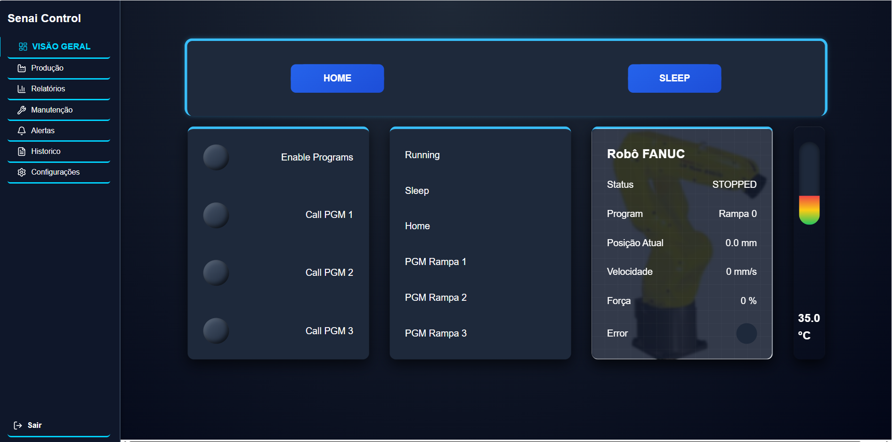

# 🏭 Dashboard de Monitoramento Industrial

Sistema de monitoramento industrial em tempo real desenvolvido com React, focado na visualização de dados operacionais e controle de máquinas.

---

## 🚀 Visão Geral

Este projeto simula um painel de controle industrial, permitindo visualizar dados operacionais, acompanhar o comportamento de máquinas e interagir com uma interface moderna e responsiva.

---

## 🎨 Versões do Sistema

O projeto possui duas versões independentes da interface:

* 🌙 **Versão Dark**  
Interface otimizada para ambientes com pouca luz

* 🌈 **Versão Colorida**  
Interface vibrante para melhor destaque visual dos dadoss

As versões foram desenvolvidas separadamente para explorar diferentes abordagens de design e experiência do usuário, permitindo comparar estilos visuais e usabilidade em contextos distintos.

---

## ⚙️ Funcionalidades

* 📊 Monitoramento de RPM em tempo real
* 🟢 Controle de status da máquina (ligado/desligado)
* 📈 Interface interativa de dashboard
* 🎨 Duas versões de interface (Dark e Colorida)
* 📱 Layout responsivo
* 🏭 Design inspirado em sistemas industriais

---

## 🛠️ Tecnologias Utilizadas

* React.js
* JavaScript (ES6+)
* CSS3
* Vite

---

## 📁 Estrutura do Projeto

```id="k3m8pz"
industrial-dashboard/
├── frontend-dark/    # Tema escuro
└── frontend/         # Tema colorido
```

---

## 📦 Instalação

Clone o repositório:

```bash id="7xw2qk"
git clone https://github.com/mvjsilva91-crypto/industrial-control-system
```

Acesse a pasta do projeto:

```bash id="m4j2vn"
cd industrial-control-system
```

Instale e execute cada projeto separadamente:

```bash id="o9z3pl"
cd frontend-dark
npm install
npm run dev
```

Em outro terminal:

```bash id="b6t1qx"
cd frontend
npm install
npm run dev
```

---

## 🎯 Objetivo

O objetivo deste projeto é demonstrar habilidades em desenvolvimento front-end aplicadas ao contexto industrial, com foco em usabilidade, design e visualização de dados em tempo real.

---


## 📸 Preview - frontend-dark



## 🌐 Demonstração frontend-dark

🎥 Assista ao vídeo: https://drive.google.com/file/d/1TKVPFEuRbyd7ci17Hbzp5AZhcReKAL3B/view?usp=sharing

---

---
## 📸 Preview - frontend


---
## 🌐 Demonstração frontend

🎥 Assista ao vídeo: https://drive.google.com/file/d/1TKVPFEuRbyd7ci17Hbzp5AZhcReKAL3B/view?usp=sharing

---

## 📄 Licença

Projeto desenvolvido para fins de estudo e portfólio.
