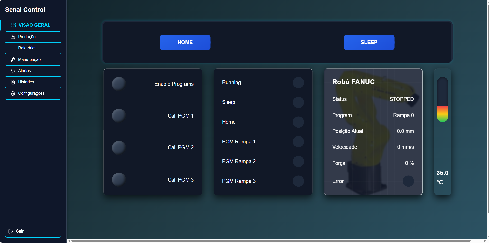

# 🏭 Dashboard de Monitoramento Industrial

Sistema moderno de monitoramento industrial desenvolvido com React, focado no acompanhamento em tempo real do desempenho de máquinas, com suporte a **dois temas (dark e colorido)**.

---

## 🚀 Visão Geral

Este projeto simula um painel de controle industrial, permitindo visualizar dados operacionais, acompanhar o comportamento de máquinas e interagir com uma interface moderna e responsiva.

---

## 🎨 Temas

O sistema possui dois modos visuais:

* 🌙 **Tema Escuro (Dark)**
  Ideal para ambientes com pouca luz, reduzindo o cansaço visual

* 🌈 **Tema Colorido**
  Interface vibrante que melhora a visualização das informações

---

## ⚙️ Funcionalidades

* 📊 Monitoramento de RPM em tempo real
* 🟢 Controle de status da máquina (ligado/desligado)
* 📈 Interface interativa de dashboard
* 🎨 Suporte a dois temas
* 📱 Layout responsivo
* 🏭 Design inspirado em sistemas industriais

---

## 🛠️ Tecnologias Utilizadas

* React.js
* JavaScript (ES6+)
* CSS3
* Vite

---

## 📁 Estrutura do Projeto

```id="k3m8pz"
industrial-dashboard/
├── frontend-dark/    # Versão com tema escuro 
└──frontend/         # Versão com tema colorido
```

---

## 📦 Instalação

Clone o repositório:

```bash id="7xw2qk"
git clone https://github.com/mvjsilva91-crypto/industrial-control-system
```

Acesse a pasta do projeto:

```bash id="m4j2vn"
cd https://github.com/mvjsilva91-crypto/industrial-control-system
```

Instale e execute cada projeto separadamente:

```bash id="o9z3pl"
cd frontend-dark
npm install
npm run dev
```

Em outro terminal:

```bash id="b6t1qx"
cd frontend
npm install
npm run dev
```

---

## 🎯 Objetivo

O objetivo deste projeto é demonstrar habilidades em desenvolvimento front-end aplicadas ao contexto industrial, com foco em usabilidade, design e visualização de dados em tempo real.

---

## 📸 Preview - frontend



---
## 📸 Preview - frontend


---

## 📄 Licença

Projeto desenvolvido para fins de estudo e portfólio.
